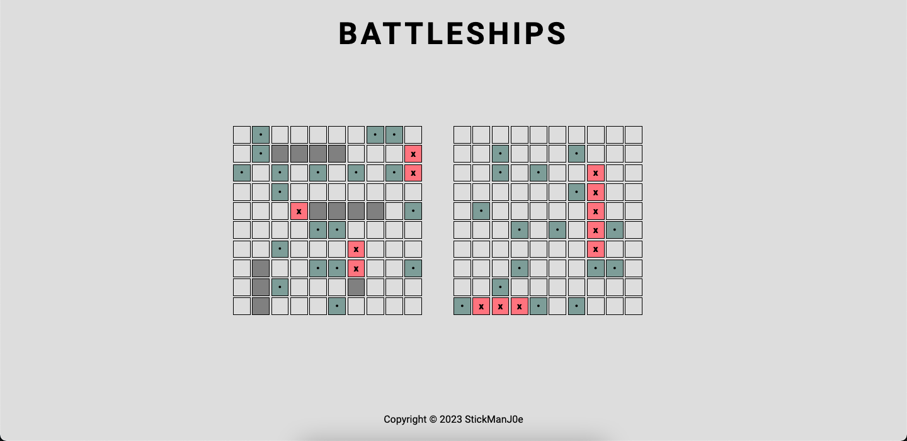
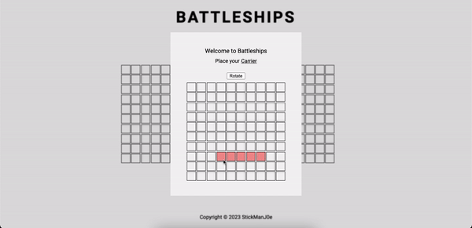
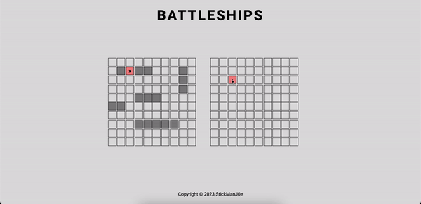
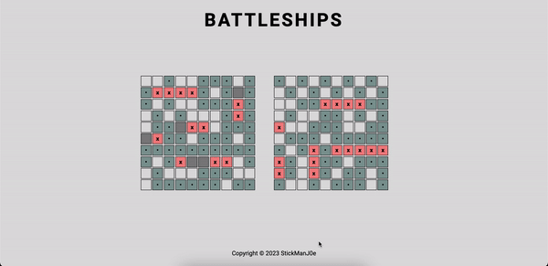

# Battleship
Battleship is a project built on Javascript and Webpack that aims to recreate the classic Battleship game. Through this project, I intended to utilise a object-oriented paradigm for devlopment, as well as using Jest for testing. 

Live Demo: https://stickmanj0e.github.io/battleship/

## Features
- An interactive browser-based game based on the Battleship board game. 
- A bot opponent the player can play against.

## Built With
- Webpack
- Javascript
- Jest